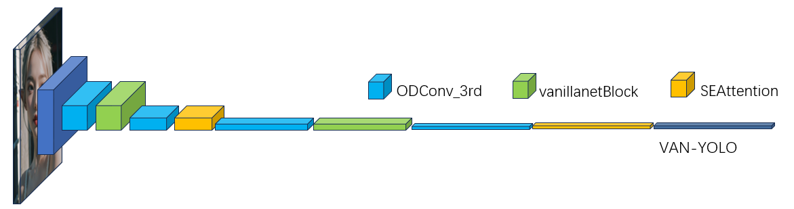
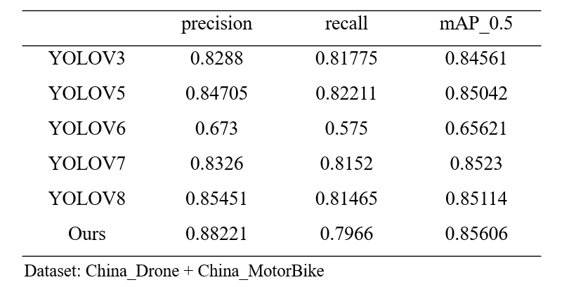

<div align="center">
  <p>
      </a>
  </p>
</div>
This project improves the backbone network of the model on the basis of YOLOV8, introducing vanilla net module and SEAttention module in the backbone network. Without changing the inference speed, the model's expression ability and receptive field depth are improved. On the RDD2022 dataset, the improvement is more significant compared to YOLOV8, and it performs well on the China-Drone and China-MotorBike datasets. The mAP50 (B) reaches 85.606%, which is 0.492% higher than the original model and 0.88% higher than the mAP50-95 (B). This model is mainly used for competitions and papers. If someone accidentally finds this model, just pretend they haven't seen it

If you want to contact the author, please send an email to wuj400646@gmail.com

The comparison of the performance of this model with other models at epoch=100 is shown below

<div align="center">
  <p>
      </a>
  </p>
</div>

## <div align="center">Documentation</div>

The DCNV3 module referenced in this project requires downloading the corresponding wheel separately. The specific method for downloading the wheel and the link to the convolutional module are as follows
[ InternImage](https://github.com/OpenGVLab/InternImage)

## Usage

### Install

- Clone this repo:

```bash
git clone https://github.com/OpenGVLab/InternImage.git
cd InternImage
```

```bash
cd ./detection/ops_dcnv3
chmod+x ./make.sh
sh ./make.sh
# unit test (should see all checking is True)
python test.py
```

## Dataset downloading

```bash
wget https://bigdatacup.s3.ap-northeast-1.amazonaws.com/2022/CRDDC2022/RDD2022/RDD2022.zip

python datapre.py
```

## train

```bash
python train.py
```
